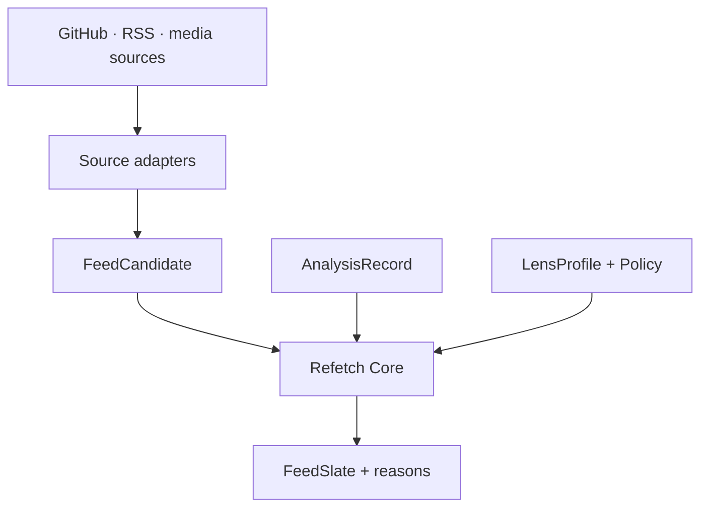

# Refetch Core

**See the same information through the lens you choose.**

[English]|[简体中文](README.zh-CN.md)

Refetch Core is an open, portable engine for building user-directed semantic feeds. It turns content from sources such as GitHub, RSS, and media platforms into a shared representation, then organizes that content through an explicit **Lens** selected by the user.

The result is a feed that can answer three useful questions for every item:

- Why is this here?
- Why is it ranked here?
- Which evidence and rules shaped the decision?

> **Project stage:** foundation. The contract, fixtures, and Dart reference engine are being designed in public.

## One source, many useful views

A platform usually presents one dominant ordering: recent, trending, popular, or personalized. Refetch lets the same candidate pool support multiple task-oriented views.

| Lens | What rises to the top |
| --- | --- |
| Production readiness | Stable releases, active maintenance, clear migration notes, and ecosystem compatibility |
| Frontier watch | New approaches, unusual architecture, fast-moving discussions, and emerging projects |
| Contribution opportunities | Well-scoped issues, maintainer activity, newcomer guidance, and projects matching your skills |
| Learning path | Foundational material, practical examples, and concepts arranged by dependency and difficulty |

For example, a GitHub release might appear like this under a production-readiness Lens:

```text
Repository release · ranked #2

Summary
A stable release improves desktop support and documents the migration path.

Why it is here
• matches the current Flutter desktop focus
• the project has recent maintainer activity
• the release includes migration notes and tests
• this topic has not appeared elsewhere in today's feed

Evidence
release notes · repository activity · dependency metadata
```

Switching to a frontier Lens can reorganize the same source material around novelty, emerging techniques, and important discussions. The source stays the same; the point of view changes.

## The core idea

Refetch models feed generation as an inspectable decision:

```text
FeedSlate = Select(Rank(Candidates, Lens, Policy, Context))
```

- **Candidates** describe what happened and where it came from.
- **Lens** expresses the user's current goal.
- **Policy** defines filters, weights, diversity, and exploration rules.
- **Context** carries session-level information such as time, seen items, and host preferences.
- **FeedSlate** contains the selected items, their order, and structured decision traces.

This separation makes every stage replaceable and testable.

## How it works



1. An adapter converts source data into a portable `FeedCandidate`.
2. An analyzer can attach summaries, topics, quality signals, and confidence as an `AnalysisRecord`.
3. The user or host selects a `LensProfile` for the current task.
4. Refetch applies scoring, filtering, deduplication, diversity, and exploration policies.
5. The host receives a `FeedSlate` with structured reasons and evidence references.

## Conceptual model

| Object | Purpose |
| --- | --- |
| `FeedCandidate` | A source-neutral envelope containing a subject, a trigger, provenance, timestamps, and source signals |
| `AnalysisRecord` | Versioned semantic enrichment such as a summary, topics, quality signals, confidence, and provenance |
| `LensProfile` | A portable description of the user's current goal, interests, weights, filters, and exploration preferences |
| `RankingDecision` | The score, eligibility result, feature contributions, and evidence-backed reasons for one candidate |
| `FeedSlate` | The final ordered collection together with slate-level diversity, coverage, and exploration information |

A **subject** is the thing being understood: a repository, release, article, video, issue, pull request, or discussion.

A **trigger** is why that subject is a candidate now: it was published, released, updated, revived, discussed, or surfaced by a source.

That distinction lets Refetch represent both timeless objects and time-sensitive events without flattening every platform into the same kind of post.

## Structured explanations

Explanations are built from the same features and evidence used by the decision engine. A renderer can turn them into natural language while preserving the underlying trace.

```json
{
  "candidateId": "github:release:example/tool:v1.4.0",
  "lensId": "production-ready",
  "score": 0.87,
  "reasons": [
    {
      "code": "RECENT_STABLE_RELEASE",
      "contribution": 0.18,
      "evidenceRefs": ["release:v1.4.0", "repo:activity:30d"]
    },
    {
      "code": "MATCHES_FOCUS_TOPIC",
      "contribution": 0.14,
      "evidenceRefs": ["analysis:topic:flutter-desktop"]
    }
  ]
}
```

This provides a stable foundation for UI explanations, debugging tools, evaluation, and future model-assisted presentation.

## Designed for portable hosts

Refetch keeps the source adapter, analysis provider, decision engine, and user interface behind explicit boundaries.

- **Language-neutral contract:** canonical JSON Schema provides a stable interchange format.
- **Dart reference engine:** the first implementation targets Flutter hosts and local execution.
- **Model-independent analysis:** analyzers publish versioned records through a common interface.
- **Local-first processing:** hosts control storage and decide when external analysis services receive data.
- **Cross-source semantics:** GitHub and RSS form the first validation pair, followed by media-platform integrations.

## The experience we are building

A useful Refetch-powered feed should help people:

- find meaningful updates earlier;
- see fewer repeated versions of the same story;
- switch goals without rebuilding their source list;
- understand why each item was selected;
- control how much familiar and exploratory material appears;
- carry the same Lens across different applications and sources.

## Planned repository layout

```text
schemas/                         canonical JSON Schema
packages/refetch_contract/       Dart contract models and codecs
packages/refetch_core/           scoring, policy, deduplication, and slate selection
packages/refetch_adapter_github/ GitHub normalization
packages/refetch_adapter_rss/    RSS and Atom normalization
packages/refetch_analyzer/       analyzer interfaces and reference adapters
fixtures/                        portable input and expected-output datasets
examples/feed_lab/               interactive GitHub + RSS validation host
```

The contract and fixtures lead the implementation so that future TypeScript, Rust, Python, Kotlin, and Swift implementations can share behavior instead of only sharing names.

## First milestones

1. Publish the vocabulary, example records, and versioned schema.
2. Implement deterministic ranking and slate selection in Dart.
3. Normalize GitHub and RSS data into shared fixtures.
4. Build Feed Lab with switchable Lenses and visible ranking reasons.
5. Embed the engine in a Flutter host and validate a media feed.

## Contributing

Refetch is at the stage where small, concrete examples can shape the architecture. Useful early contributions include:

- GitHub and RSS fixture datasets;
- Lens examples for real information tasks;
- ranking and diversity evaluation methods;
- JSON Schema and Dart model review;
- explanation UI experiments;
- adapter prototypes for additional sources.

Open an issue with a real feed scenario, a sample input, and the result you would want to receive. Those examples will guide the contract and reference implementation.

---

**Refetch Core — your information, organized around your intent.**
