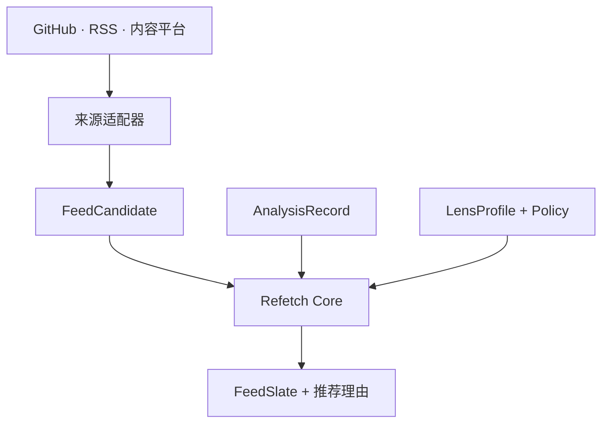

# Refetch Core

**同一批信息，由你选择观察视角。**

[English](README.md) | 简体中文

Refetch Core 是一个开放、可移植的用户可控语义信息流引擎。它把 GitHub、RSS 和内容平台等来源转换为统一表达，再按照用户主动选择的 **Lens（信息视角）** 组织内容。

最终生成的信息流能够为每一项内容回答三个问题：

- 为什么它会出现？
- 为什么它排在这里？
- 哪些证据与规则共同形成了这个决定？

> **项目阶段：** 基础设计期。契约、测试样本与 Dart 参考实现正在公开构建中。

## 一个来源，多种有用视角

平台通常提供近期、热门、趋势或个性化等主要排序。Refetch 让同一候选集能够围绕用户此刻的任务形成多种视角。

| Lens | 优先呈现的内容 |
| --- | --- |
| 生产可用 | 稳定版本、持续维护、清晰迁移说明与生态兼容性 |
| 前沿观察 | 新方法、非常规架构、快速发展的讨论与新兴项目 |
| 寻找贡献机会 | 边界明确的问题、活跃维护者、新人指引与技能匹配项目 |
| 学习路线 | 基础资料、实践示例，以及按依赖关系和难度组织的知识 |

例如，在“生产可用”Lens 下，一条 GitHub Release 可以这样呈现：

```text
仓库版本发布 · 排名第 2

摘要
一个稳定版本改进了桌面端支持，并提供了清晰的迁移路径。

为什么推荐
• 与当前的 Flutter 桌面开发目标匹配
• 项目近期保持活跃维护
• 版本包含迁移说明与测试
• 今日信息流中尚未出现相同主题

证据
Release Notes · 仓库活跃度 · 依赖元数据
```

切换到“前沿观察”Lens 后，同一批来源可以围绕新颖性、新技术与重要讨论重新组织。来源保持一致，观察视角随任务改变。

## 核心思路

Refetch 把信息流生成表达成一个可检查的决策过程：

```text
FeedSlate = Select(Rank(Candidates, Lens, Policy, Context))
```

- **Candidates** 描述发生了什么，以及信息来自哪里。
- **Lens** 表达用户当前希望完成的任务。
- **Policy** 定义过滤、权重、多样性与探索规则。
- **Context** 承载时间、已读记录和宿主偏好等会话信息。
- **FeedSlate** 包含最终条目、排序结果与结构化决策轨迹。

这些对象彼此分离，使每个阶段都可以独立替换与测试。

## 工作流程



1. 适配器把平台数据转换为可移植的 `FeedCandidate`。
2. 分析器可以用 `AnalysisRecord` 附加摘要、主题、质量信号与置信度。
3. 用户或宿主为当前任务选择 `LensProfile`。
4. Refetch 执行评分、过滤、去重、多样性与探索策略。
5. 宿主收到包含结构化理由和证据引用的 `FeedSlate`。

## 概念模型

| 对象 | 作用 |
| --- | --- |
| `FeedCandidate` | 与来源无关的候选封装，包含主体、触发事件、来源证据、时间与平台信号 |
| `AnalysisRecord` | 带版本的语义分析，包括摘要、主题、质量信号、置信度与分析来源 |
| `LensProfile` | 对用户当前目标、关注主题、权重、过滤条件与探索偏好的可移植表达 |
| `RankingDecision` | 单个候选项的得分、资格判断、特征贡献与证据化理由 |
| `FeedSlate` | 最终有序列表，以及列表层面的多样性、覆盖度与探索信息 |

**Subject（主体）** 是正在被理解的对象，例如仓库、版本、文章、视频、Issue、Pull Request 或讨论。

**Trigger（触发事件）** 表达它为什么此刻成为候选项，例如发布、更新、重新活跃、发生重要讨论或被来源发现。

主体与触发事件分开后，Refetch 可以同时表达长期存在的对象与具有时效性的变化，也能保留不同平台的内容特点。

## 结构化推荐理由

推荐理由直接来自决策引擎实际使用的特征与证据。展示层可以将它们转换为自然语言，同时保留底层决策轨迹。

```json
{
  "candidateId": "github:release:example/tool:v1.4.0",
  "lensId": "production-ready",
  "score": 0.87,
  "reasons": [
    {
      "code": "RECENT_STABLE_RELEASE",
      "contribution": 0.18,
      "evidenceRefs": ["release:v1.4.0", "repo:activity:30d"]
    },
    {
      "code": "MATCHES_FOCUS_TOPIC",
      "contribution": 0.14,
      "evidenceRefs": ["analysis:topic:flutter-desktop"]
    }
  ]
}
```

这为界面解释、调试工具、效果评估和模型辅助表达提供了稳定基础。

## 面向多种宿主设计

Refetch 通过明确边界连接来源适配器、分析服务、决策引擎与用户界面。

- **语言无关契约：** 使用规范 JSON Schema 提供稳定交换格式。
- **Dart 参考实现：** 第一版面向 Flutter 宿主与本地运行环境。
- **模型无关分析：** 分析器通过统一接口发布带版本的分析记录。
- **本地优先处理：** 宿主控制数据存储，并决定何时将数据交给外部分析服务。
- **跨来源语义：** 首先使用 GitHub 与 RSS 验证，再扩展到内容平台。

## 我们希望实现的体验

一个真正有用的 Refetch 信息流应当帮助用户：

- 更早发现有意义的更新；
- 减少同一事件的重复内容；
- 在保留来源的同时切换当前目标；
- 理解每一项内容被选中的原因；
- 主动控制熟悉内容与探索内容的比例；
- 在不同应用和来源之间复用同一 Lens。

## 计划中的仓库结构

```text
schemas/                         规范 JSON Schema
packages/refetch_contract/       Dart 契约模型与序列化
packages/refetch_core/           评分、策略、去重与列表选择
packages/refetch_adapter_github/ GitHub 数据标准化
packages/refetch_adapter_rss/    RSS 与 Atom 数据标准化
packages/refetch_analyzer/       分析器接口与参考适配器
fixtures/                        可移植输入与预期输出数据集
examples/feed_lab/               GitHub + RSS 交互式验证宿主
```

契约和测试样本先于实现，使未来的 TypeScript、Rust、Python、Kotlin 与 Swift 实现能够共享行为，而不仅仅共享对象名称。

## 第一阶段里程碑

1. 发布核心术语、示例记录与带版本的 Schema。
2. 使用 Dart 实现确定性的排序与列表选择。
3. 将 GitHub 与 RSS 数据标准化为共享测试样本。
4. 构建支持 Lens 切换与推荐理由展示的 Feed Lab。
5. 将引擎嵌入 Flutter 宿主并验证内容平台信息流。

## 参与贡献

Refetch 正处于具体案例可以直接影响架构的阶段。适合早期参与的方向包括：

- GitHub 与 RSS 测试数据集；
- 来自真实信息任务的 Lens 示例；
- 排序与多样性评估方法；
- JSON Schema 与 Dart 模型评审；
- 推荐理由的界面实验；
- 新来源的适配器原型。

欢迎通过 Issue 提交真实信息流场景、示例输入以及你期望获得的结果。这些案例将直接指导契约与参考实现。

---

**Refetch Core —— 让信息围绕你的意图重新组织。**
